# Harness 架构全景 · 第 1-22 章

## 全景思维导图

每个章节右侧标了它在环中的位置。

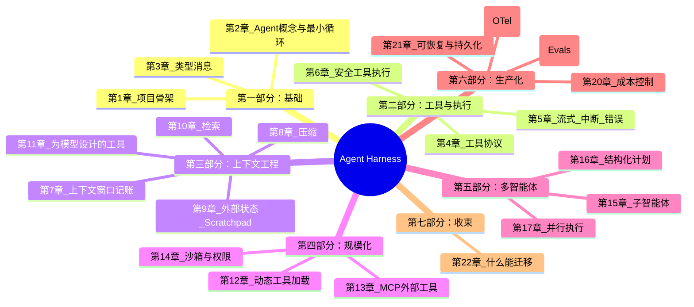

## 一图纵览：ReAct 环 → Harness

整个 Harness 所有子系统的**顺序**和**位置**都在这个环里了。①-⑪ 是每回合的流水线。
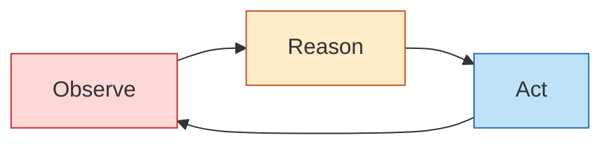

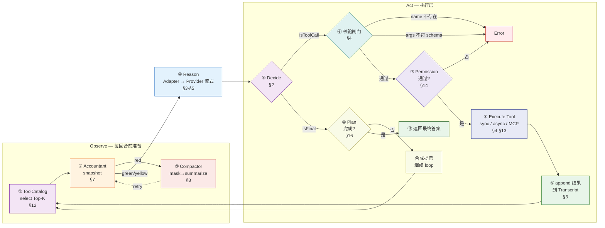

---

## 第一部分：基础（第 1-3 章）

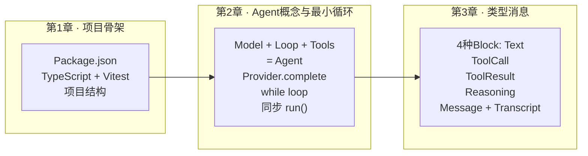

### 关键概念流

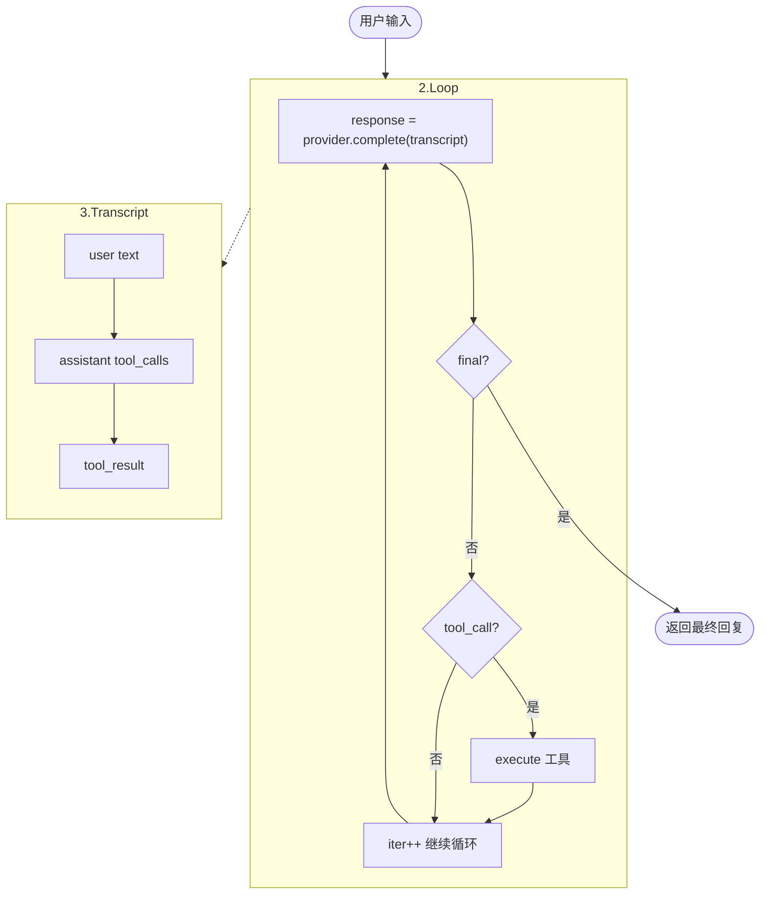

---

## 第二部分：工具与执行（第 4-6 章）

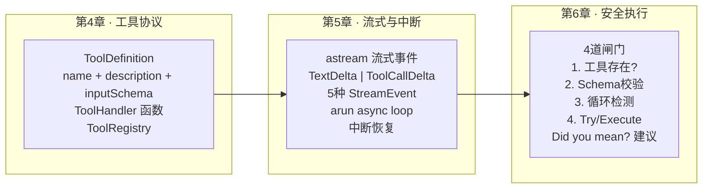

### execute() 的 4 道闸门

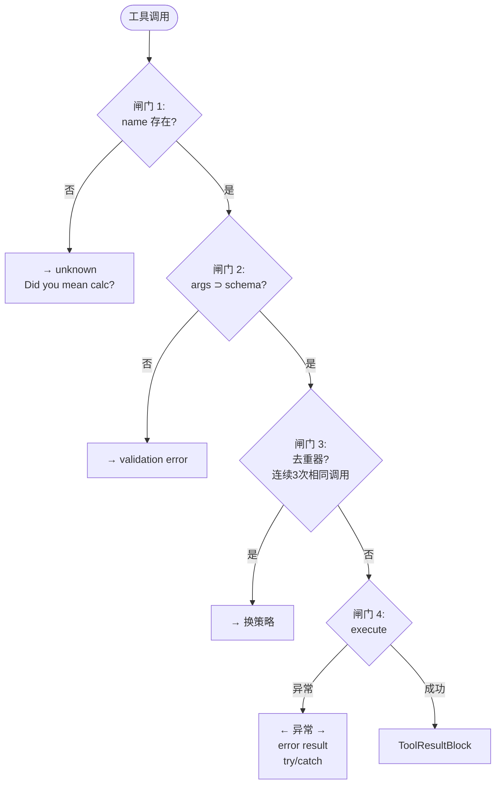

---

## 第三部分：上下文工程（第 7-11 章）

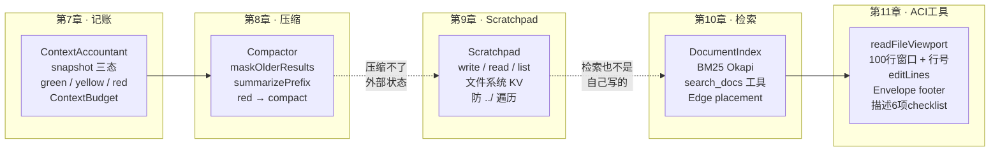

### 上下文生命周期

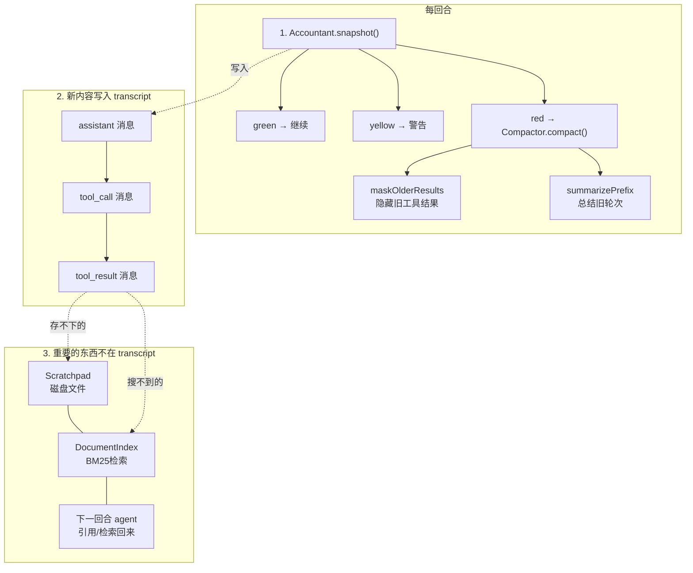

---

## 第四部分：规模化（第 12-14 章）

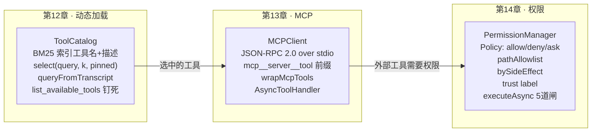

### 第 12 章：每回合工具选择流程

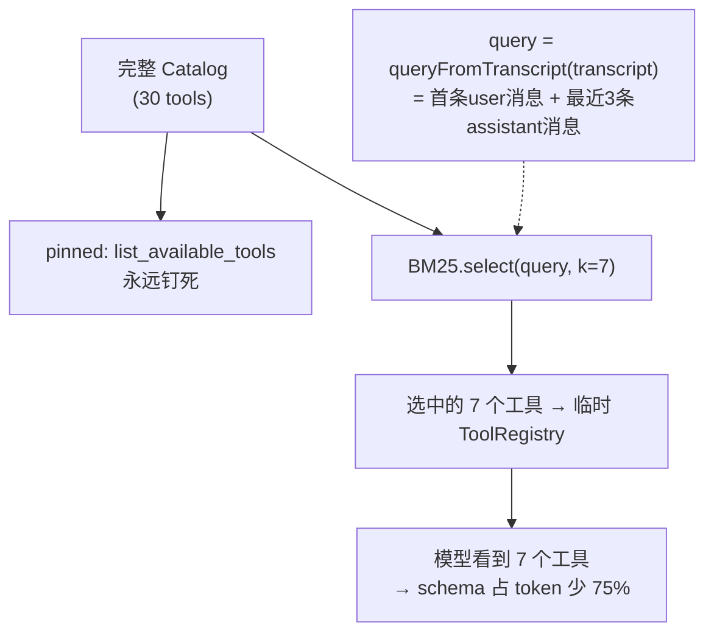

### 第 14 章：executeAsync 的 5 道闸门

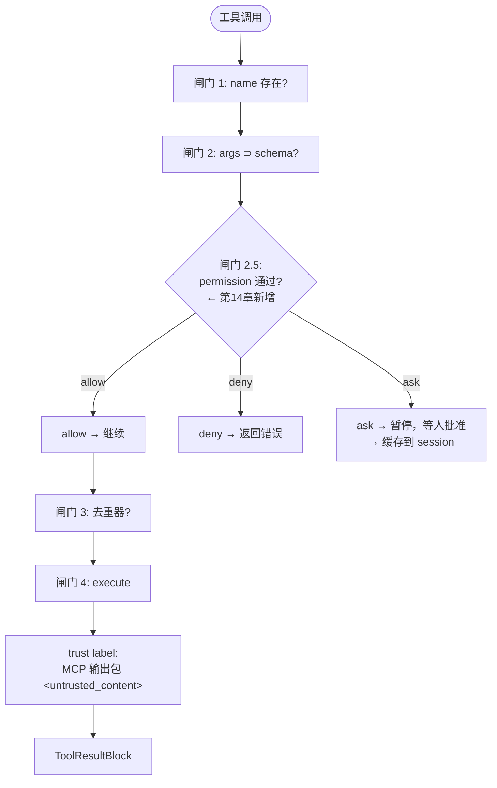

---

## 第五部分：多智能体（第 15 章）

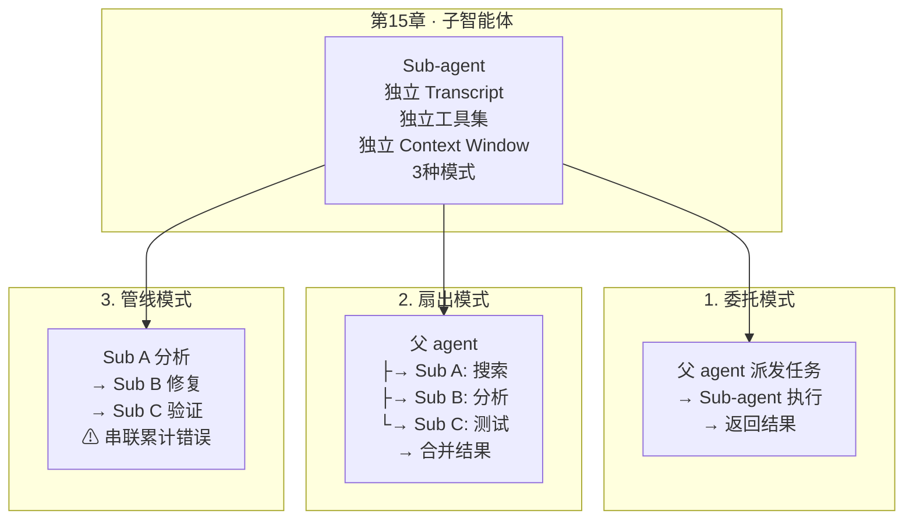

---

## 完整架构总览

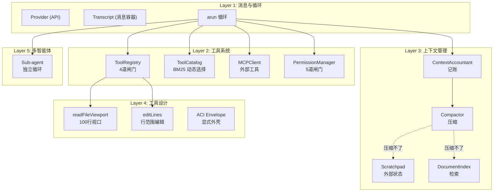

## 数据流全景

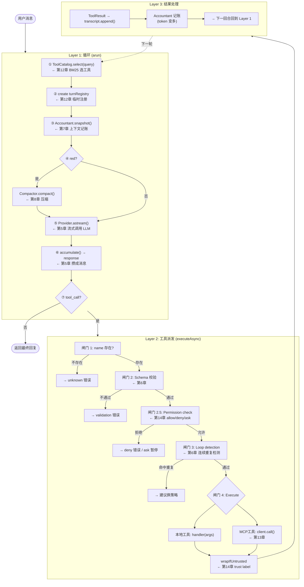

---

## 各章节贡献的代码组件

| 章节 | 核心组件 | 位置 |
|------|----------|------|
| ch1 | 项目骨架、tsconfig、vitest | `package.json`、`tsconfig.json` |
| ch2 | `run()`、`Provider` 接口 (含 Agent 概念) | `src/harness/agent.ts` |
| ch3 | `Message`、`Transcript`、4 种 Block | `src/harness/messages.ts` |
| ch4 | `ToolRegistry`、`ToolDefinition`、`ToolHandler` | `src/harness/tools/registry.ts` |
| ch5 | `arun()`、`StreamEvent`、`accumulate()` | `src/harness/agent.ts`、`providers/` |
| ch6 | Schema 校验、循环检测、`Did you mean?` | `src/harness/tools/registry.ts` |
| ch7 | `ContextAccountant`、`ContextBudget`、`ContextSnapshot` | `src/harness/context/accountant.ts` |
| ch8 | `Compactor`、`maskOlderResults`、`summarizePrefix` | `src/harness/context/` |
| ch9 | `Scratchpad`（write/read/list） | `src/harness/tools/scratchpad.ts` |
| ch10 | `DocumentIndex`（BM25）、`search_docs` | `src/harness/retrieval/` |
| ch11 | `readFileViewport`、`editLines`、Envelope | `src/harness/tools/files.ts` |
| ch12 | `ToolCatalog`、`queryFromTranscript`、`createDiscoveryEntry` | `src/harness/tools/selector.ts` |
| ch13 | `MCPClient`、`wrapMcpTools` | `src/harness/mcp/` |
| ch14 | `PermissionManager`、Policy、trust label | `src/harness/permissions/` |
| ch15 | Sub-agent 概念与设计模式 | 文档 |
| ch16 | `Planner`、`PlanStep`、结构化计划 | `src/harness/plans/` |
| ch17 | 并行执行概念与设计模式 | 文档 |
| ch18 | `ObservabilityExporter`、Tracing spans | `src/harness/observability/` |
| ch19 | `EvalRunner`、trace-based eval | `src/harness/evals/` |
| ch20 | `CostRouter`、cost enforcer | `src/harness/cost/` |
| ch21 | `CheckpointManager`、resume/serialize | `src/harness/checkpoint/` |
| ch22 | 多 provider 迁移策略 | 文档 |

