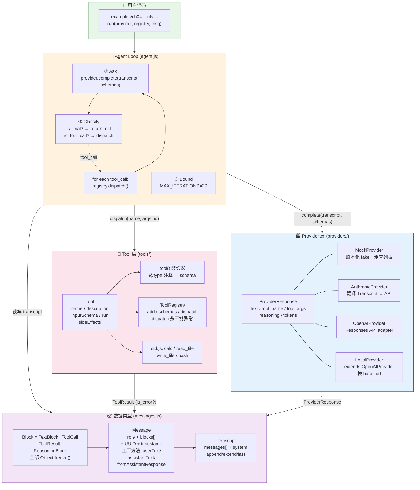
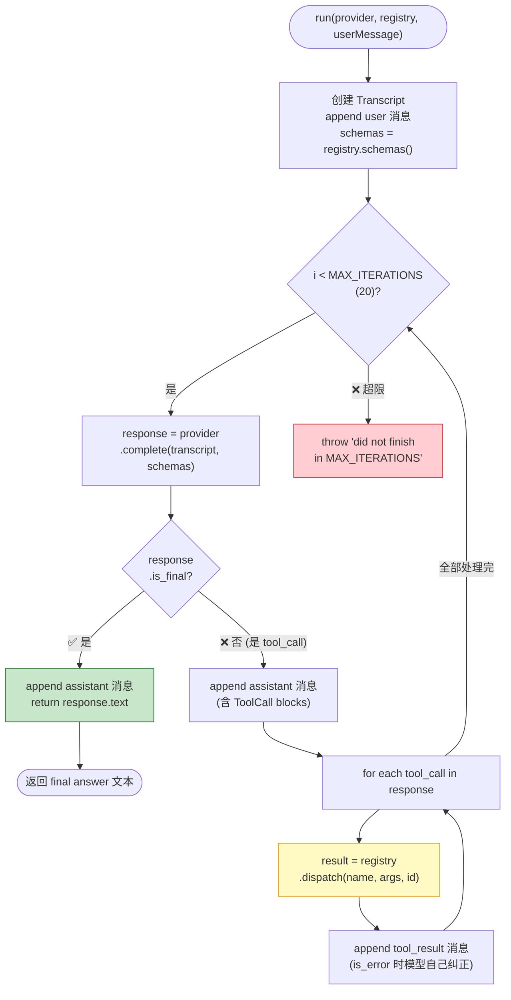
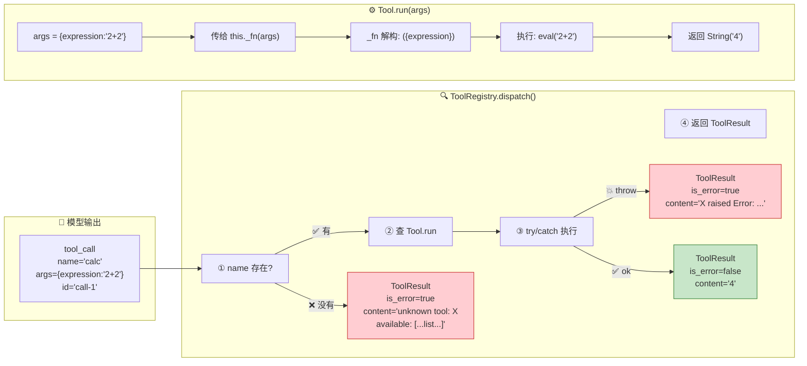
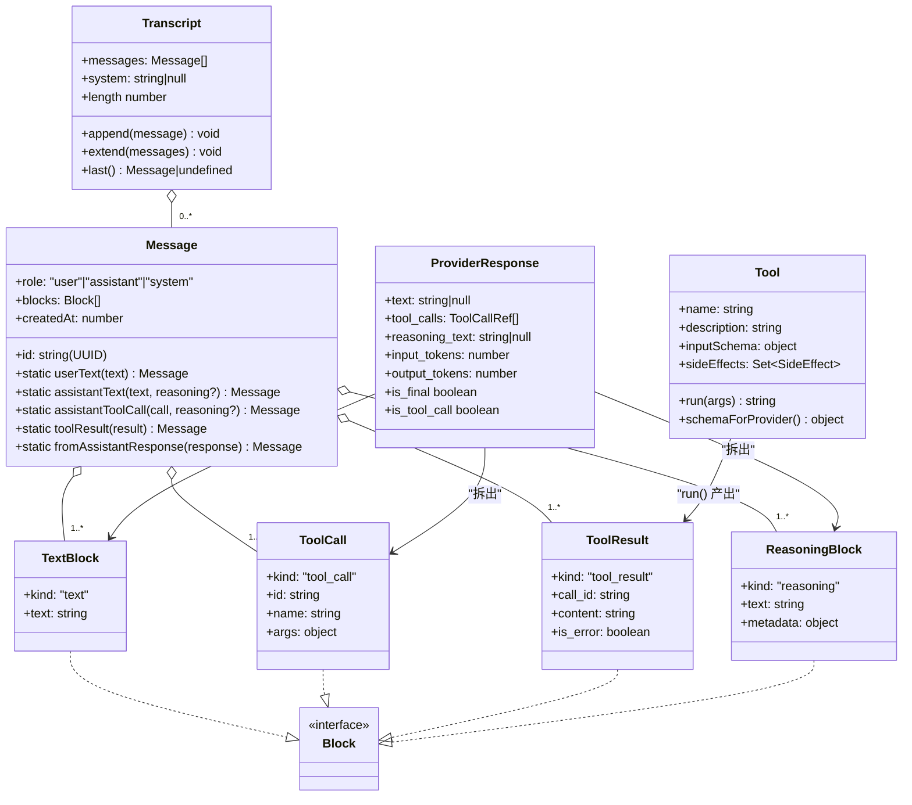
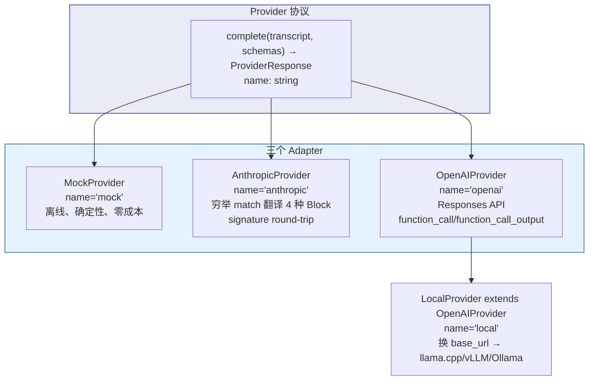
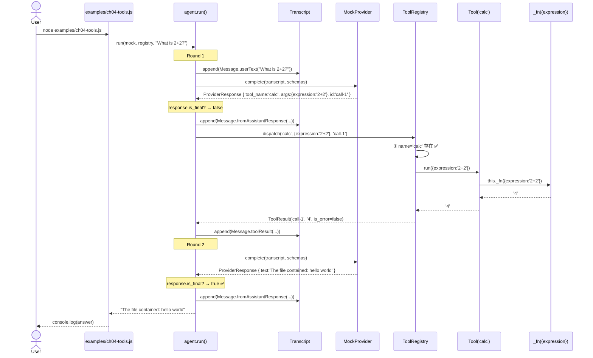
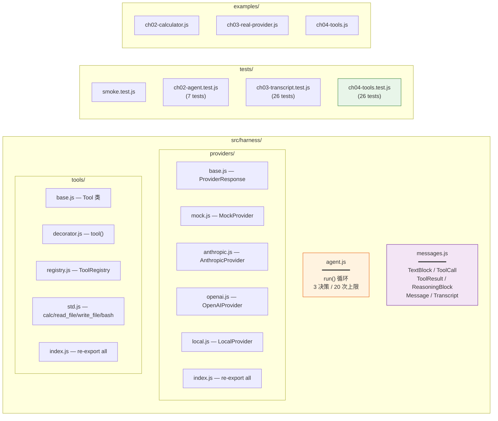
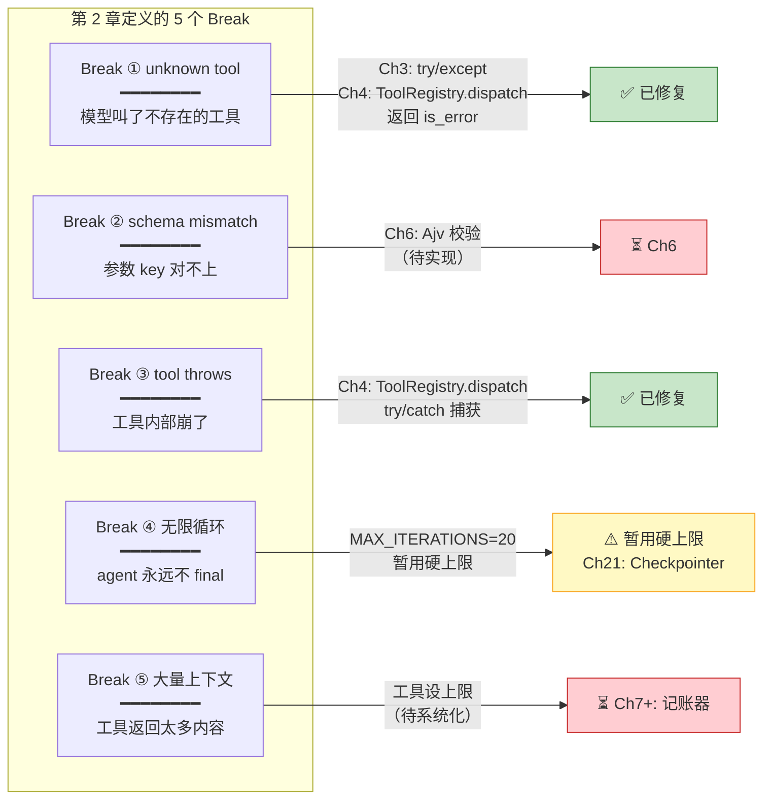

# Harness 架构图 — 第 1-4 章

> 以下 Mermaid 图展示 `harness-tutorial` 项目经过前 4 章构建后的完整架构。
> 可在 VS Code（安装 Markdown Preview Mermaid 插件）或 GitHub 上直接渲染。

---

## 1. 整体架构总览

---

## 2. Agent 循环 — 3 个决策

---

## 3. 工具执行管线 — 从模型输出到结果

---

## 4. 数据类型层级 — Block → Message → Transcript

---

## 5. Provider 适配器 — 三厂商，一份协议

---

## 6. 调用链全景 — 一次完整的 calculator 回合

---

## 7. 文件结构 — 4 章后的代码布局

---

## 8. 5 个 Break — 全书路线图

---

## 关键设计决策

| 决策 | 选择 | 理由 |
|------|------|------|
| Block 可变性 | `Object.freeze()` | 不可变 = 可缓存、可并行、可比较 |
| dispatch 异常处理 | 返回 `is_error` ToolResult，不抛 | 模型能读懂结构化错误并自我纠正 |
| 工具参数传递 | `run(args)` 传整个对象 | 函数用解构 `({ expr })` 取，和 JSON Schema 对齐 |
| schema 推导 | `@type` 内联注释 | JS 无 Python type hints，用 JSDoc `@type` 代替 |
| 标准工具声明 | 直接 `new Tool({...})` | 复杂工具显式写 schema，简单工具用 `tool()` 装饰器 |
| Provider 协议 | `complete(transcript, schemas)` | 所有 adapter 只依赖这一个方法签名 |
| 副作用标签 | 现在就标 | 第 14 章 PermissionManager 和第 21 章 Checkpointer 靠它决策 |
