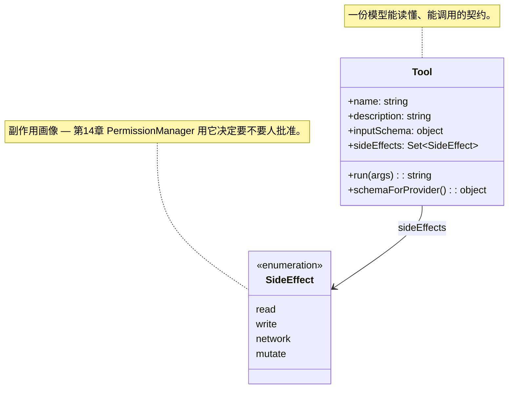
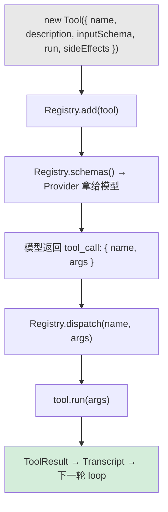
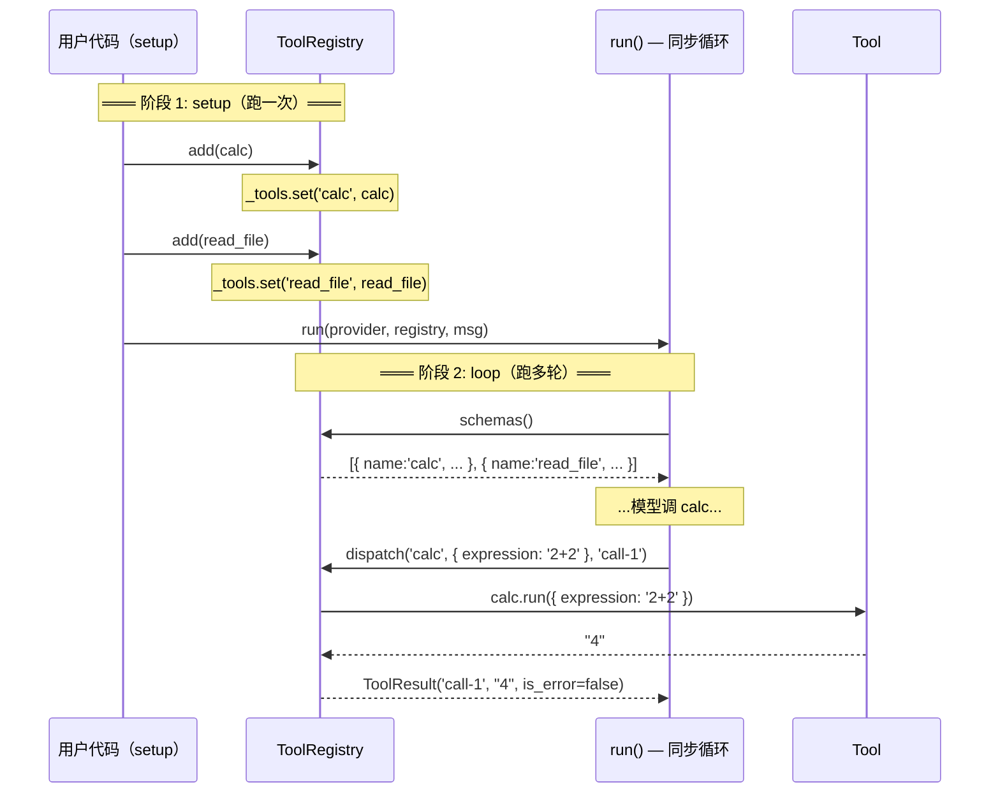
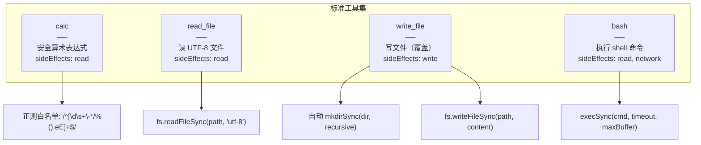

# 第 4 章：工具协议

> 第 3 章的 Agent 只会说话不会干活。第 4 章定义工具协议：一个稳定的契约让模型调用外部函数，拿到结果后继续推理。

---

## 1. 工具契约 = 5 个字段



| 字段 | 谁看 | 作用 |
|------|------|------|
| `name` | 模型 + Provider | 模型决定调"calc"还是"bash" |
| `description` | 模型 | 模型读这段文字判断工具能干什么 |
| `inputSchema` | Provider + Validator | Provider 把 JSON Schema 交给模型；ch06 用它校验参数 |
| `run(args)` | Agent loop | args 是 schema 定义的 kwarg dict，返回字符串 |
| `sideEffects` | 未来章节 | `read`/`write`/`network`/`mutate` — 现在只是声明 |

---

## 2. Tool 生命周期



两步走：
1. **注册**：`ToolRegistry.add(tool)` → `schemas()` 一次导出给 Provider
2. **分发**：模型调用 → `dispatch(name, args)` → `tool.run(args)` → 结果回到 loop

---

## 3. Registry：一个名字一个工具



Registry 的核心设计：
- **以 `name` 为 key** — 模型说调什么名字就找什么工具
- **重名抛异常** — `add()` 不允许同名覆盖
- **`schemas()` 是批量导出** — Provider 一次性拿到所有工具的 schema

---

## 4. decorator：手写 vs 自动推导

```mermaid
flowchart TD
    subgraph "方式一：手写 new Tool()"
        HW["new Tool({ name, description, inputSchema: {... }, run: fn, sideEffects })"]
        HW2["✅ 清晰，所有字段可见"]
        HW3["❌ 样板代码多"]
    end

    subgraph "方式二：tool() 装饰器（预留）"
        DECO["tool({ sideEffects })(fn)"]
        DECO2["✅ @type 推导 schema，JSDoc 提取 description"]
        DECO3["⚠️ 目前用调用形式（JS 不支持 @ 语法）"]
    end

    HW --> CHOICE["本教程选方式一：手写"]
    DECO --> CHOICE

    note for CHOICE "对教学最友好 — 读者一眼看到每个字段。"
```

`decorator.js` 已实现但不强制用。`std.js` 全部手写 `new Tool()` — 每个字段都在眼前，教学最清晰。

---

## 5. 四个标准工具



| 工具 | schema 参数 | 安全措施 |
|------|-------------|----------|
| `calc` | `expression: string` | 正则白名单 → `new Function()` |
| `read_file` | `path: string` | 只读，无写入能力 |
| `write_file` | `path: string, content: string` | 自动建父目录 |
| `bash` | `command: string, timeout_seconds?: number` | timeout cap 300s, maxBuffer 10MB |

---

## 6. args 解构：模型的世界 vs JS 的世界

```mermaid
flowchart LR
    MODEL["模型返回 { expression: '2+2' }"] --> TOOL["Tool.run(args)"]
    TOOL --> ARROW["run: ({ expression }) => String(fn(...))"]
    ARROW --> RESULT["'4'"]

    note for ARROW "JS 解构：{ expression } = args<br/>— 模型给的是 dict，run 拿到的是值。"
```

关键约定：**`run()` 的参数是 `inputSchema` 定义的 key→value dict。** JS 用解构转成局部变量；Python 用 `**kwargs` 展开。模型不需要知道语言细节。

---

## 7. schemaForProvider：Anthropic 格式

```mermaid
flowchart LR
    TOOL["Tool { name, description, inputSchema }"]
    --> SP["schemaForProvider()"]
    --> OUT["{ name, description, input_schema }"]

    note for OUT "key 名 snake_case 是 Anthropic API 的要求。<br/>Provider adapter 负责翻译成各家格式。"
```

Anthropic 要求字段叫 `input_schema`（下划线），但 Tool 内部用 `inputSchema`（驼峰）。`schemaForProvider()` 做这个转换。

---

## 8. 文件清单

| 文件 | 变更 | 说明 |
|------|------|------|
| `src/harness/tools/base.js` | **新增** | `Tool` 数据类 + `SideEffect` typedef |
| `src/harness/tools/decorator.js` | **新增** | `tool()` 工厂 — 从 JSDoc 自动推导 schema |
| `src/harness/tools/registry.js` | **新增** | `ToolRegistry`: add / dispatch / schemas |
| `src/harness/tools/std.js` | **新增** | 4 个标准工具: calc, read_file, write_file, bash |
| `src/harness/tools/index.js` | **新增** | 统一导出 |
| `src/harness/messages.js` | 扩建 | `ToolResult` 工厂 + `fromAssistantResponse` 处理 tool_call |
| `src/harness/agent.js` | 扩建 | loop 中检测 tool_call → dispatch → 追加 ToolResult |
| `src/harness/providers/mock.js` | 扩建 | 支持 `tool_name` / `tool_args` 字段 |
| `tests/ch04-tools.test.js` | **新增** | 26 tests: Tool, Registry, decorator, std 全覆盖 |
| `examples/ch04-tools.js` | **新增** | 工具注册 + Agent 循环演示 |

---

## 9. 第 4 章不做什么

| 缺失项 | 对应章节 |
|--------|----------|
| 参数校验（模型传错 shape 直接炸） | 第 6 章 ValidationError |
| 循环检测（同一调用反复重试） | 第 6 章 LoopDetector |
| 异步执行（所有工具同步跑） | 第 5 章 async 重构 |
| 权限控制（`write_file` 无路径限制） | 第 14 章 PermissionManager |
