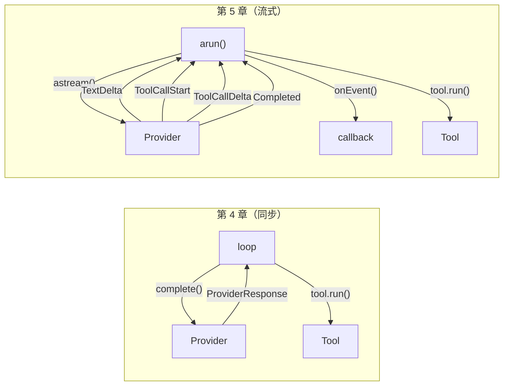
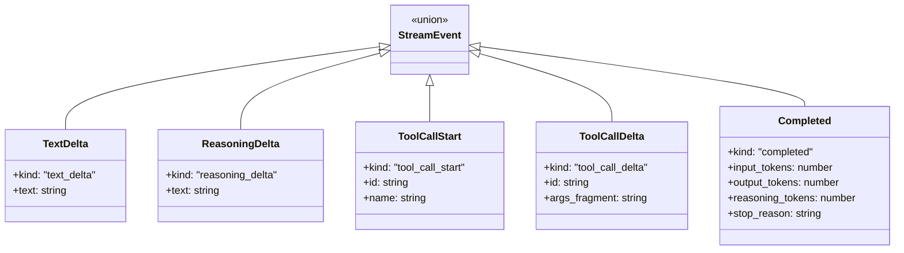
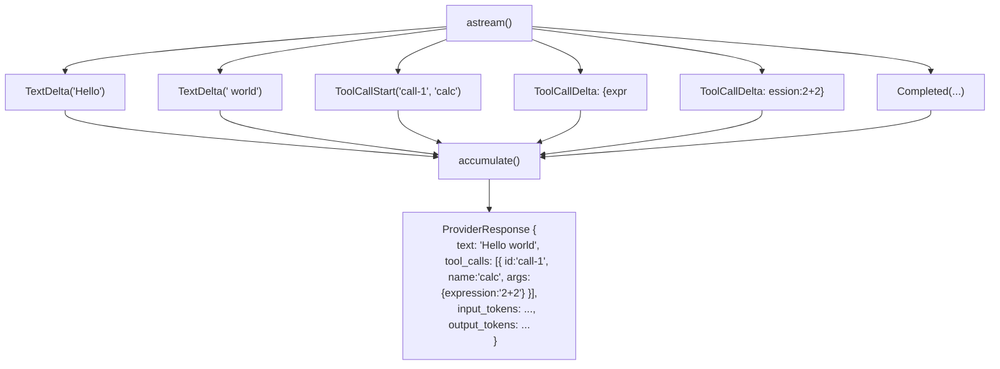
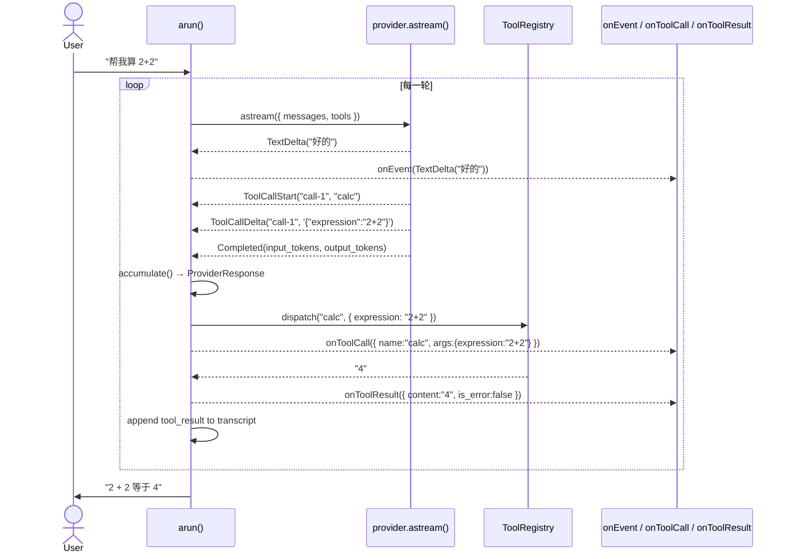
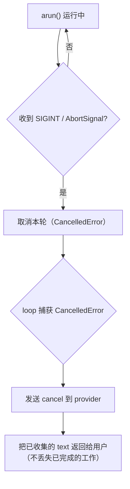
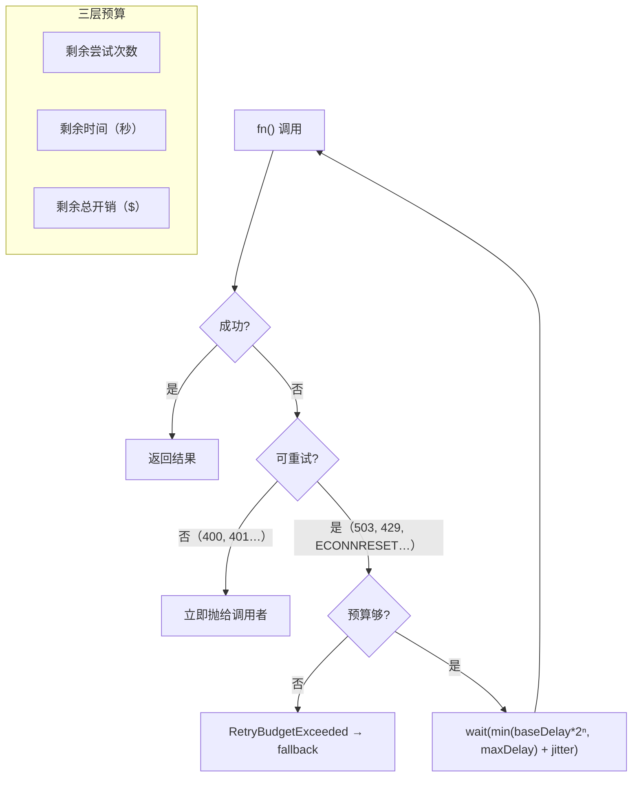
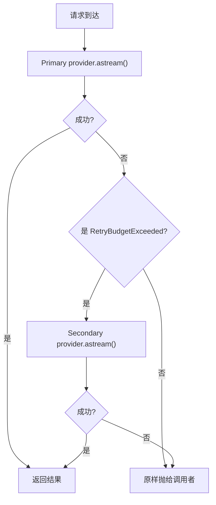

# 第 5 章：流式、中断与错误处理

> 第 4 章的工具协议是同步的：loop 调用 `provider.complete()` → 拿到整个响应 → 派发工具 → 再来一瓶。
> 第 5 章把这一切变成**异步流式**的，同时加上中断保护、重试和降级。

---

## 1. 核心改造：从同步到流式



变化：
- **`Provider.complete()` → `Provider.astream()`** — 返回 `AsyncIterator<StreamEvent>`，不再一次性返回
- **`run()` → `arun()`** — async 循环，逐一处理流事件
- **`ProviderResponse` 是一次 final** — 由 `accumulate()` 从事件流拼出来，或者流式结束后自然得到

---

## 2. 五种 StreamEvent



| Event | 含义 | 何时发出 |
|---|---|---|
| `TextDelta` | 一个文本 token 片段 | 模型流式输出每个 token |
| `ReasoningDelta` | 一个推理/思考 token | 扩展推理（o1/Claude extended） |
| `ToolCallStart` | 工具调用开始 | 模型决定调用工具 |
| `ToolCallDelta` | 工具参数片段（JSON 分片） | 参数逐步到达 |
| `Completed` | 流结束，含 token 用量 | 模型完成本次推理 |

为什么不偷懒用一个 `delta`？因为 **`ToolCallStart` 给了 name**，loop 可以先显示 "正在调用 calc..." 而不是等参数全到才告诉用户。

---

## 3. accumulate：拼图



逻辑：
1. `TextDelta` / `ReasoningDelta` → 拼成 `text` / `reasoning_text` 字符串
2. `ToolCallStart` → 创建 `ToolCallRef` 占位
3. `ToolCallDelta` → 逐个追加 `args_fragment` 到对应 call 的 JSON 缓冲区
4. `Completed` → `JSON.parse` 拼接完毕的 args JSON → 填入 `tool_calls` 数组
5. 如果 JSON 不完整（partial），放进 `{ _raw: '...' }` 兜底

---

## 4. arun() 异步循环



关键 callbacks：

| callback | 签名 | 时机 |
|---|---|---|
| `onEvent` | `(event: StreamEvent) => void` | 每个流事件到达 |
| `onToolCall` | `(call: {name, args}) => void` | 派发工具前 |
| `onToolResult` | `(result: {content, is_error}) => void` | 工具返回后 |

---

## 5. 中断保护（Ctrl-C）



核心原则：**中断不丢数据**。即使 Ctrl-C，已完成轮次的 `text` 仍然返回，不会让你白等。

---

## 6. RetryPolicy：三层预算



| 参数 | 默认 | 说明 |
|---|---|---|
| `maxAttempts` | 3 | 最多尝试次数 |
| `baseDelay` | 1s | 退避基数 |
| `maxDelay` | 60s | 退避上限 |
| `maxTotalSeconds` | 300 | 总时间预算 |
| `retryableStatuses` | 429,500,502,503,504 | HTTP 状态码白名单 |
| `retryableCodes` | ECONNRESET,ETIMEDOUT,ECONNREFUSED | Node 错误码白名单 |

---

## 7. FallbackProvider：主备双路



关键设计：
- **loop 不知道 FallbackProvider 是复合的** — 它只是 `astream()` 接口的一个实现
- 只有 `RetryBudgetExceeded`（重试预算耗尽）才触发 fallback
- 400 Auth / 404 等不可重试错误不会 fallback
- Secondary 也失败则原样抛出

---

## 8. 文件清单

```
src/harness/providers/
├── events.js        # 5 种 StreamEvent 工厂函数（全部 frozen）
├── accumulate.js    # StreamEvent 流 → ProviderResponse
├── base.js          # ToolCallRef + ProviderResponse（camelCase + 向后兼容）
├── mock.js          # astream() / acomplete() / complete()
├── retry.js         # RetryPolicy（指数退避 + 三层预算）
├── fallback.js      # FallbackProvider（主备双路，组合式继承）
├── anthropic.js     # Anthropic adapter（沿用 ch04）
├── openai.js        # OpenAI adapter（沿用 ch04）
└── index.js         # 统一导出

src/harness/agent.js  # arun() + run() 同步包装
src/harness/messages.js # fromAssistantResponse 支持多 tool_calls[]
```

---

## 9. 向后兼容一览

| 旧代码（ch04） | 新代码（ch05） | 兼容？ |
|---|---|---|
| `resp.tool_name` | → `resp.tool_calls[0]?.name` | ✅ getter 兼容 |
| `resp.tool_args` | → `resp.tool_calls[0]?.args` | ✅ getter 兼容 |
| `resp.tool_call_id` | → `resp.tool_calls[0]?.id` | ✅ getter 兼容 |
| `run(provider, reg, msg)` | → `run(provider, reg, msg)` | ✅ 自动检测 `provider.complete` |
| `new ProviderResponse({ tool_name, tool_args })` | → 构造函数自动转 `tool_calls[]` | ✅ |
| `Message.fromAssistantResponse(resp)` | → 迭代 `resp.tool_calls` 数组 | ✅ 透明升级 |
