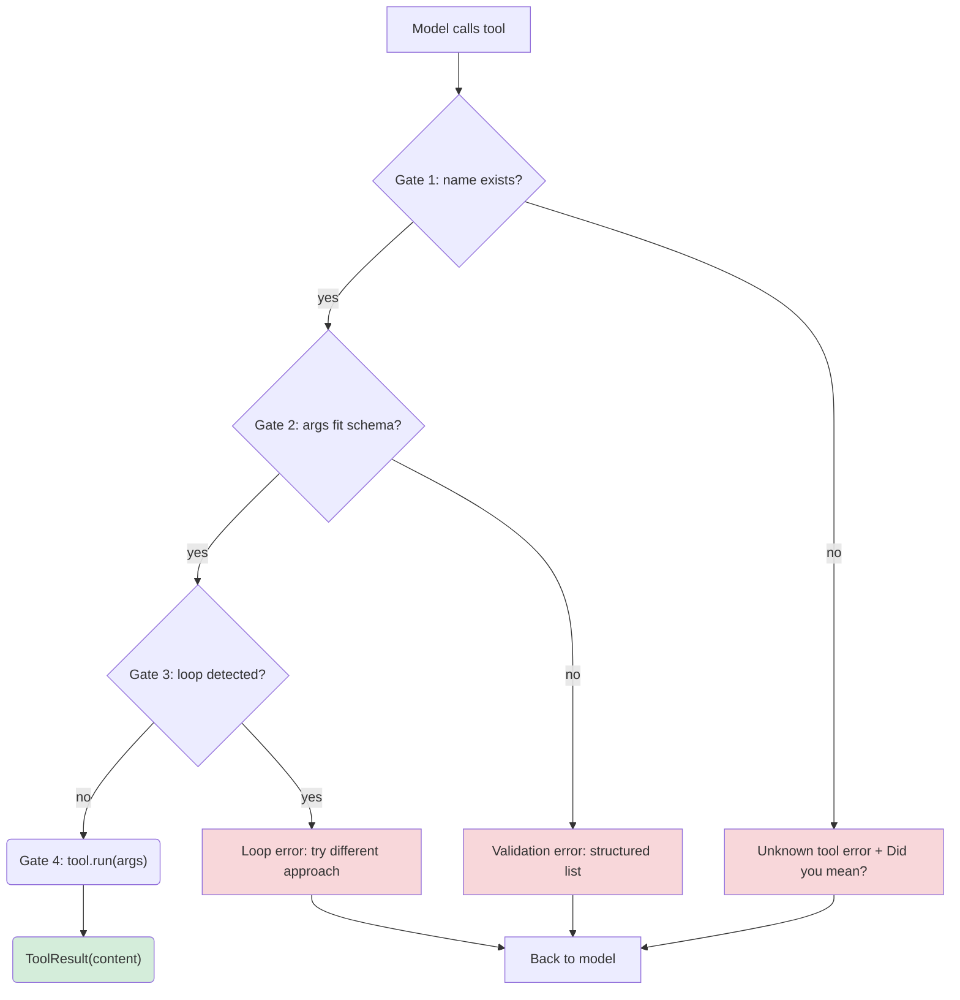
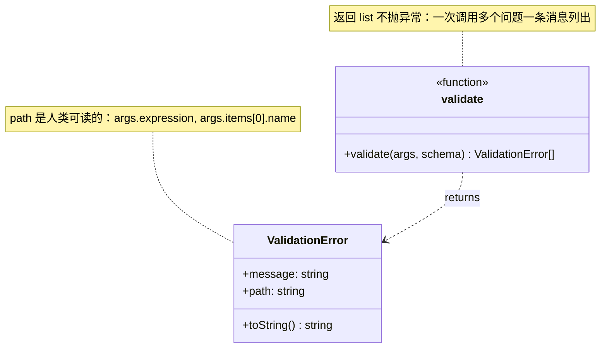
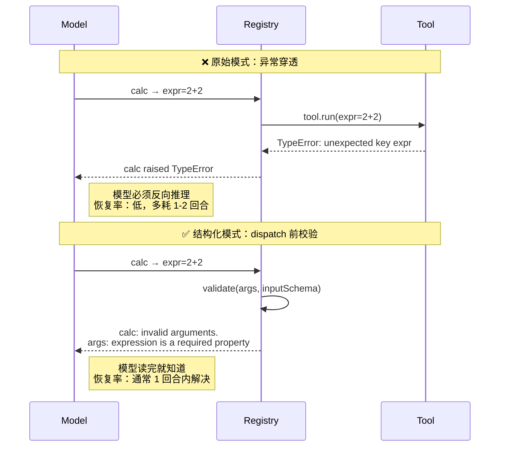
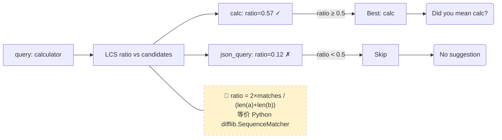
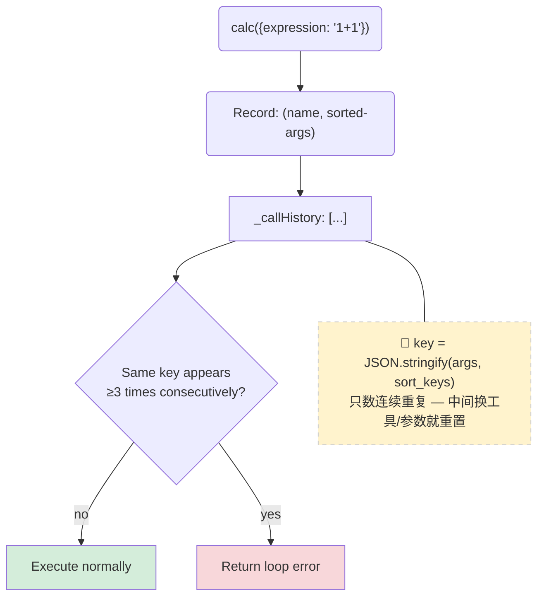
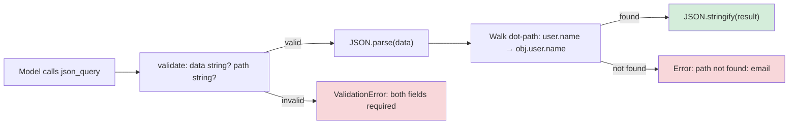

# 第 6 章：安全工具执行

> 第 2 章的 5-break 表还剩两个开着的：模型传错参数 shape、用相同参数反复调同一个工具。
> 第 6 章在 registry dispatch 之前插入 4 道闸门，把这两个 break 关掉。

---

## 1. 四道闸门架构

**任一闸门短路 → 结构化错误 → 回到模型。** 模型读到的错误消息是专门为它写的，不是 Python 调试风格的 traceback。

---

## 2. ValidationError：结构化校验

**为何返回列表而不是抛第一个异常？** 一个工具调用可能有多个参数问题（类型错 + 缺必填 + 多了未知字段）。模型从"一条错误消息列出三件事"学得比"连续 3 个回合各修一个"快得多。

---

## 3. Reflexion 效应：结构化 vs 原始异常

Shinn et al. _Reflexion_ (NeurIPS 2023) 经验性证明：收到结构化反馈的 agent，恢复速度显著快于看原始 trace 的 agent。

---

## 4. Did You Mean? — LCS Ratio 模糊匹配

`difflib.get_close_matches` 的 JS 等价实现：LCS（最长公共子序列）ratio，cutoff=0.5。`calculator` → `calc` 的 ratio ≈ 0.57 > 0.5，命中。`fly_to_moon` → 任何工具的 ratio 都远低于 0.5，不命中。

---

## 5. Loop Detector：精确匹配去重

**精确匹配，不模糊。** `calc("1+1")` 和 `calc("1 + 1")` 是不同的 key — 参数变了就是在前进。只抓真正"无招可出"的循环。

---

## 6. json_query：校验的压力测试

`json_query` 有两个必填 string 参数 — validator 和工具函数各负责一部分失败模式。Validator 抓"参数类型/缺失"；工具函数抓"JSON 无效/路径不存在"。

---

## 7. 文件清单

| 文件 | 变更 | 说明 |
|------|------|------|
| `src/harness/tools/validation.js` | **新增** | `ValidationError` + `validate()` (ajv) |
| `src/harness/tools/registry.js` | **重写** | 4 道闸门 dispatch + LCS ratio + loop detector |
| `src/harness/tools/std.js` | +1 工具 | `json_query` — JSON dot-path 查询 |
| `src/harness/tools/index.js` | +2 导出 | `ValidationError`, `validate`, `json_query` |
| `src/harness/providers/mock.js` | fix | 构造时自动 `new ProviderResponse(raw)` |
| `tests/ch06-validation.test.js` | **新增** | 15 tests：4 闸门全覆盖 |
| `examples/ch06-safe-tools.js` | **新增** | 4 闸门 + Agent 集成演示 |

---

## 8. Registry 还不做什么

| 缺失项 | 对应章节 |
|--------|----------|
| 权限控制（`write_file` 不给 path 限制） | 第 14 章 |
| 可观测性（dispatch 无 log/span） | 第 18 章 |
| 成本核算（不知道模型花了多少钱调用） | 第 20 章 |

三样都干净地插入，**因为 registry 是唯一的 dispatch 点** — 加功能的代价正比于它们做的事，而不是工具数量。
